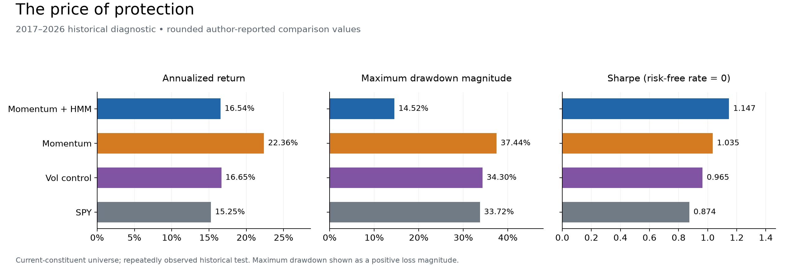
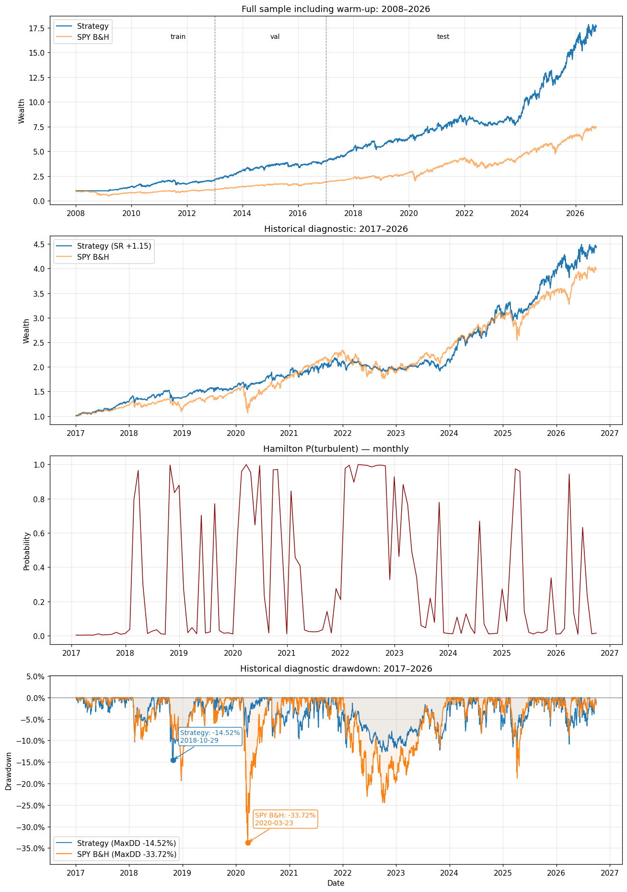
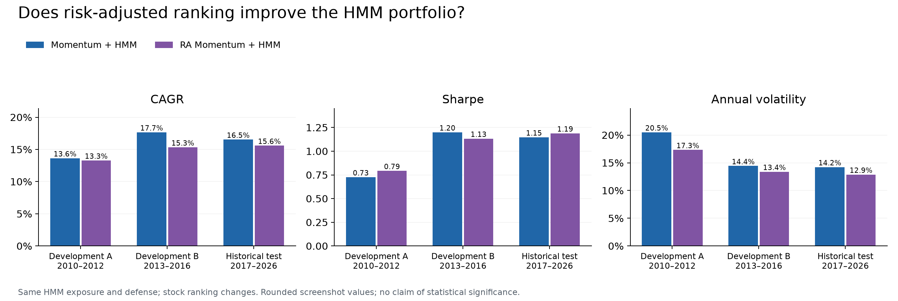

# Latent Regime Momentum

### Student-t hidden-state inference for dynamic equity–gold–cash allocation

**A quantitative research project on the price of portfolio protection.** Cross-sectional momentum selects stocks; a two-state Student-t hidden Markov model adjusts how much capital remains in equities. The research asks whether the reduction in portfolio risk is worth the return sacrificed by defensive allocation.

[Research notebook](notebooks/01_latent_regime_momentum.ipynb) · [Mathematics & execution](docs/METHODOLOGY.md) · [Experiments](docs/EXPERIMENTS.md) · [Limitations & roadmap](docs/LIMITATIONS.md) · [Evidence provenance](results/published/README.md)

> **Evidence status.** These are historical research results, not live performance or an untouched holdout. The stock universe uses current S&P 500 constituents, and the 2017–2026 interval was repeatedly inspected during development. The publication pass preserves saved results; it does not claim a new full-history rerun.

## 1. The question, the hypothesis, and the trade-off

A momentum portfolio can compound strongly while suffering large drawdowns. A defensive overlay may reduce losses, but it can also exit too late, miss rebounds, or remain underinvested. A higher terminal wealth curve alone does not establish which portfolio is preferable.

**Hypothesis:** latent volatility states contain useful information for allocating between a stock-selection engine and a defensive sleeve. **Falsification check:** compare the HMM against the same momentum portfolio without an overlay and against a simpler historical-volatility rule. A more complex model must justify its complexity.

The historical diagnostic comparison captures the trade-off:

| Portfolio | CAGR | Sharpe¹ | Maximum drawdown | Annual volatility |
|---|---:|---:|---:|---:|
| **Momentum + Student-t HMM** | **16.54%** | **1.147** | **−14.52%** | **14.23%** |
| Pure momentum | 22.36% | 1.035 | −37.44% | 21.82% |
| Simple volatility control | 16.65% | 0.965 | −34.30% | 17.57% |
| SPY buy-and-hold | 15.25% | 0.874 | −33.72% | 18.13% |

*2017-01-03–2026-09-30. ¹ Zero risk-free rate. Strategy transaction costs included; SPY has no modeled transaction charge. Main HMM/SPY return metrics are corroborated by saved notebook output; volatility and comparison metrics come from the author's rounded experiment tables. Sources and precision are recorded in [published results](results/published/README.md).*



**Finding:** in this sample, the HMM sacrifices 5.82 percentage points of CAGR versus pure momentum while reducing maximum drawdown magnitude by 22.92 points. It is a risk/return trade-off, not a claim that the HMM maximizes returns. The simple volatility rule earns almost the same CAGR as the HMM but experiences a much deeper maximum drawdown.

## 2. How the pieces connect

```text
Stock prices ──► lagged 252-day momentum ──► top-100 equal-weight stock sleeve
                                                                        │
SPY returns ──► expanding Student-t HMM ──► high-volatility probability ──┤
                                                                        ▼
                         monthly target: equities + gold + cash
                                           │
                               next trading day's close
                                           │
                    drifted holdings + self-financing transaction costs
                                           │
                    benchmark comparisons, ablations and diagnostics
```

| Step | Design choice | Why it matters |
|---|---|---|
| Data | Separate valuation marks from executable quotes | A carried mark is not permission to trade at a stale price |
| Selection | Top 100 stocks by lagged momentum | Separates stock selection from market exposure |
| State inference | Two Student-t states, weekly expanding fits | Allows heavy-tailed observations and persistent latent states |
| Allocation | Equity weight `1 − p`; residual half GLD, half cash | Turns state uncertainty into a continuous target allocation |
| Execution | Signal at close *t*, trade at close *t+1* | Avoids earning returns with positions not yet acquired |
| Evaluation | Same-engine baselines and disclosed negative results | Tests whether complexity adds useful protection |

## 3. The model in four equations

**Momentum score.** The implemented signal is a full 252-trading-day return shifted by 21 trading days:

$$M_{i,t}=\frac{P_{i,t-21}}{P_{i,t-273}}-1.$$

It is not the alternative $P_{t-21}/P_{t-252}-1$ convention. Finite scores with a signal-day quote are ranked across the available stock universe; the top 100 form an equal-weight sleeve. There is no positive-score requirement.

**Latent state.** SPY log returns, measured in percentage points, follow one of two Student-t distributions:

$$y_t=100\log\left(\frac{P_t^{SPY}}{P_{t-1}^{SPY}}\right),\qquad y_t\mid s_t=j\sim t_\nu(\mu_j,\sigma_j),\quad P_{ij}=\Pr(s_t=j\mid s_{t-1}=i).$$

The states share estimated degrees of freedom. The higher-scale state is labeled high volatility. Student-t scale is not its standard deviation; the distinction is explicit in [the methodology](docs/METHODOLOGY.md).

**Allocation.** With filtered high-volatility probability $p_t$ and fixed $\gamma=1$:

$$w_t^{eq}=(1-p_t)^\gamma,\qquad w_t^{GLD}=w_t^{cash}=\frac{1-w_t^{eq}}{2}.$$

The HMM does not rank stocks. A high-volatility probability is not a crash probability, and the strategy does not wait for a 0.5 threshold to begin reducing exposure.

**Self-financing costs.** For drifted weights $d$, target weights $q$, per-side fee $c=0.0007$ and retained wealth fraction $x$:

$$x=1-c\sum_{i\ne CASH}|xq_i-d_i|,\qquad r_t^{net}=(1+g_t)x-1.$$

The fee is applied to traded security amounts, not to cash transfers or passive weight drift.

## 4. Backtest protocol and saved evidence

- **Universe:** 503 stock columns in the supplied current-constituent dataset; not historical index membership.
- **History:** 2008–2009 warm-up; 2010–2016 development; 2017–2026-09-30 historical test/diagnostic.
- **Model:** weekly expanding estimation after 252 observations; monthly decisions use the latest available weekly endpoint.
- **Execution:** next trading day's close; new holdings first earn the following day's return. No leverage or shorting.
- **Costs:** 7 bps per security side; cash return is zero. Gold remains risky.
- **Failure policy:** failed fits retain the last valid parameters but refilter new observations; initial failure stops the run.
- **Splits:** legacy `train`/`val` keys remain as development subperiods. They are reporting slices; no automatic validation-set parameter selection occurs.

<details>
<summary>Development subperiods and historical test: source notebook table</summary>

| Period | Portfolio | CAGR | Sharpe | Max drawdown |
|---|---|---:|---:|---:|
| 2010–2012 | HMM strategy | 13.64% | 0.726 | −23.10% |
| 2010–2012 | SPY | 10.82% | 0.651 | −18.61% |
| 2013–2016 | HMM strategy | 17.67% | 1.200 | −13.64% |
| 2013–2016 | SPY | 14.22% | 1.102 | −13.02% |
| 2017–2026 | HMM strategy | 16.54% | 1.147 | −14.52% |
| 2017–2026 | SPY | 15.25% | 0.874 | −33.72% |

The overlay does **not** reduce maximum drawdown versus SPY in every subperiod. The source's `Sharpe > SPY + 0.3` threshold is not met in the historical test; its overall four-condition verdict remains `FAIL`.

</details>



*Exact figure extracted from the submitted notebook, not a regenerated equity path. “Train/val/test” labels in the saved figure retain the original reporting convention; “test” does not imply an untouched holdout.*

## 5. What was tested—and what was not adopted

| Experiment | Change | Observation | Research decision |
|---|---|---|---|
| Pure momentum | Remove the defensive overlay | Highest diagnostic CAGR; deepest drawdown | Keep as the essential return benchmark |
| Simple volatility control | 63-day realized momentum volatility, 15% reference target, monthly resizing, same cash/GLD defense | Similar diagnostic CAGR to HMM; MaxDD −34.30% | Does not replace the baseline in this sample |
| Risk-adjusted momentum | Divide the original stock score by lagged 252-day volatility | Lower volatility; no consistent improvement across development and diagnostic periods | Retain as a negative/mixed result, not a new winner |
| Within-sector momentum | Sector ranking and equal sector capital weights | Proposed code, no verified result in this release | Pending; do not claim performance |

The risk-adjusted HMM version raises diagnostic Sharpe from 1.147 to 1.189, but lowers CAGR from 16.54% to 15.59% and barely changes maximum drawdown (−14.52% to −14.46%). Its validation-subperiod Sharpe is lower than the baseline. This is not consistent evidence of a better selection signal.



See [experiment definitions and complete tables](docs/EXPERIMENTS.md). The code to reproduce the completed comparisons is in [experiments.py](src/lrm/experiments.py). No result is reported for a proposed but unexecuted sector variant.

## 6. What the implementation demonstrates

- **Probabilistic modeling:** Student-t emissions, forward filtering, backward smoothing, EM updates, state identification and convergence diagnostics.
- **Time-series discipline:** expanding fits, lagged stock signals and explicit signal/execution/return timestamps.
- **Portfolio engineering:** drifting holdings, explicit cash, self-financing fees, missing-quote guards and actual-notional turnover.
- **Research design:** ablations separating stock selection from exposure, simpler controls and preservation of unfavorable findings.
- **Reproducibility:** portable input paths, an extracted numerical core, source hashes, published-result provenance and data-free unit tests.

The implementation also exposes weaknesses rather than hiding them: deterministic initialization, probability-space densities, zero cash yield and non-point-in-time membership remain visible research limitations.

## 7. Reproduce or inspect

**No market data is needed to read the notebook, inspect the figures, run unit tests, or regenerate the summary charts.** Reproducing the full backtest requires the two original-format price files; they are not redistributed here because vendor/adjustment/redistribution provenance is not established.

```bash
git clone https://github.com/easonqin7/latent-regime-momentum.git
cd latent-regime-momentum
python -m venv .venv
source .venv/bin/activate
python -m pip install -r requirements.txt
python -m unittest discover -s tests -v
python scripts/render_published_results.py
```

For a historical rerun, first read [the data contract](data/README.md), then:

```bash
python scripts/run_research.py --data-dir /path/to/licensed/price-files --output-dir results/local
```

This estimates the weekly HMM and can take substantial time. It exports daily series, weights, signals, model logs, performance tables, input hashes and comparison plots. It does not overwrite the published snapshot. Alternatively:

```bash
python -m pip install jupyterlab
jupyter lab notebooks/01_latent_regime_momentum.ipynb
```

The notebook supports `LRM_DATA_DIR` or a local `data/` directory. Numerical-library versions and different input vintages can change results. The full historical publication rerun was intentionally not performed; see [validation status](docs/VALIDATION.md).

```text
notebooks/       English research narrative with saved source outputs
src/lrm/         HMM, execution engine, data loader and comparison strategies
scripts/         Historical runner and published-summary figure renderer
tests/           Data-free timing, accounting and model-consistency checks
results/published/  Rounded source-backed tables, logs and provenance
assets/          Published figures
docs/            Methodology, experiments, limitations and validation
data/            Input specification; no private market-price files
```

## 8. Limitations and the next research steps

1. **Fix the universe before optimizing signals:** point-in-time constituents, delisted names, corporate actions and verified total-return conventions.
2. **Freeze a prospective protocol:** fixed design, data vintage and evaluation criteria; keep the already inspected interval as historical research.
3. **Test the incremental value of timing:** static exposure-matched allocations and simple volatility controls calibrated only on development data.
4. **Quantify uncertainty:** paired block bootstrap, subperiod and tail-event sensitivity; account for repeated strategy selection.
5. **Stress implementability:** spread/slippage, liquidity, capacity, turnover, cash yield and inability to trade stale/ halted assets.
6. **Harden the model:** log-domain filtering, multiple initializations, failure monitoring and probability calibration against clearly defined subsequent-risk outcomes.

No crash-avoidance “win rate” is asserted without a specified event definition, timing convention and denominator. Read [the full limitations and prioritized roadmap](docs/LIMITATIONS.md).

## References and project lineage

The original research prompt was inspired by [Aymen Hafsaoui's regime-switching portfolio project](https://github.com/aymen-hafsaoui/portfolio-optimization-regime-switching). This repository presents the supplied stock-momentum/Student-t allocation implementation and its subsequent research, not that project's reported results or optimization architecture. See [ACKNOWLEDGEMENTS.md](ACKNOWLEDGEMENTS.md).

- Hamilton, J. D. (1989), *A New Approach to the Economic Analysis of Nonstationary Time Series and the Business Cycle*.
- Peel, D. & McLachlan, G. J. (2000), [*Robust mixture modelling using the t distribution*](https://people.smp.uq.edu.au/GeoffMcLachlan/pm_sc00.pdf). Background on latent-precision weighting; the paper is not a claim of financial performance.
- Moreira, A. & Muir, T. (2017), [*Volatility-Managed Portfolios*](https://www.nber.org/papers/w22208). Motivation for a simple risk-scaling comparator; this project's monthly rule is not a replication of that paper.

*Research and educational use. Historical figures are descriptive and do not establish investable alpha.*
